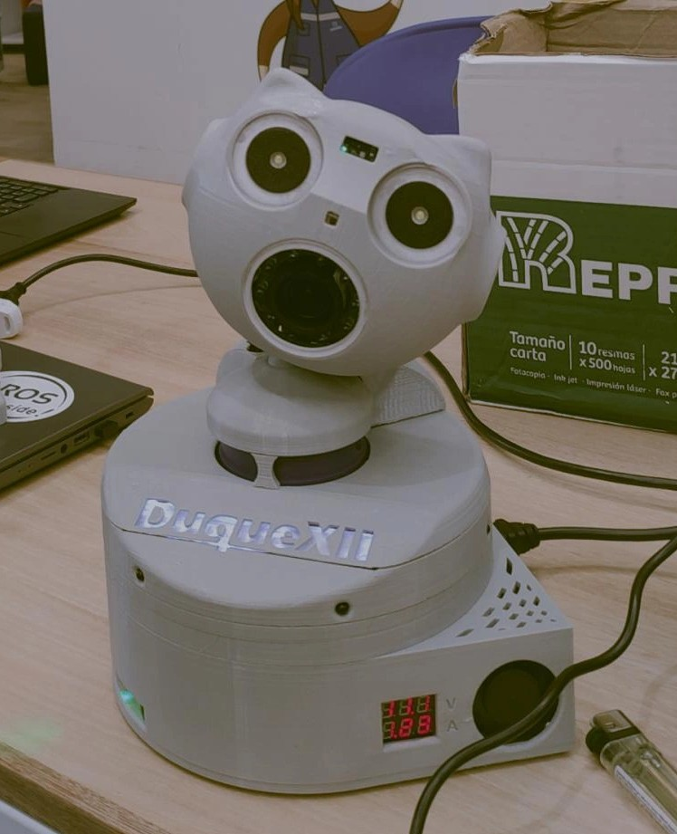

# DuqueXII - Robot for Preventing Domestic Accidents

  

---

## Table of Contents

1. [Introduction](#introduction)
2. [Repository Contents](#repository-contents)
3. [DuqueXII PCBs](#duquexii-pcbs-printed-circuit-board)
4. [System Integration](#system-integration)
5. [Improvements](#improvements)
6. [Future Work](#future-work)
7. [Setup](#setup)
8. [Video](#video)
9. [Technologies Used](#technologies-used)
10. [References](#references)
11. [Copyright Notice](#copyright-notice)

---

## Introduction
DuqueXII is a stationary robot designed to prevent domestic accidents during early childhood. This project was developed as a final undergraduate thesis at Universidad de los Andes by the student Leffer Trochez, under the supervision of professors Jorge Alfredo López Jiménez and Nicanor Quijano Silva. The robot combines advanced detection, control, and communication technologies to monitor children's surroundings and ensure their safety. DuqueXII features an Arducam PTZ camera, enabling visual tracking with pan, tilt, and zoom capabilities to optimize risk detection in the environment.

DuqueXII integrates multiple sensors, cameras, and actuators and uses platforms such as ROS2 for data management, Flask for the web interface, and I2C for communication with the camera. The Jetson Nano and Arduino Nano 33 BLE Sense work together via USB serial to execute the robot’s functionalities.  
This repository complements the academic article and demonstrates the process and results obtained. It is important to note that this version of the robot represents a first iteration, leaving room for improvements to be implemented in future versions.

---

## Repository Contents

Below is a detailed description of each folder and its content:

1. **3D Design**  
   This folder contains the complete CAD model of the robot, designed using Fusion 360. The design includes all individual components and assemblies necessary to understand and visualize the robot's basic movements. The model was reviewed in collaboration with the IMEC consulting office at Universidad de los Andes' Mechanical Engineering Department, where adjustments were made to ensure the viability and functionality of the movement mechanisms, along with recommendations for 3D printing.

2. **Code**  
   This folder contains the final code necessary for the robot's operation. It includes the code for the eight ROS2 nodes running on the Jetson Nano with Ubuntu 20, responsible for integrating and managing data from sensors and actuators. It also includes the Arduino Nano 33 BLE Sense code, which controls peripheral components, and the Flask-based web page code that allows user interaction with the robot.  
   Additionally, the folder includes the YDLidar graph, where blue detections correspond to the robot's left side and red detections to the right. Undetected zones show no data, but the robot can gather full environmental information by rotating 360 degrees.

3. **IMEC Consulting Office**  
   This folder contains documents related to the advisory process provided by the IMEC consulting office. It includes the review process of the initial CAD design, corrections to movement mechanisms to ensure successful operation, and final recommendations for 3D printing, such as configuration parameters and component adjustments. All of this is summarized in a final report provided by the consultant.

4. **Costs**  
   This folder includes a summary of the overall costs for building the robot, estimated as of December 2024. It provides an approximate breakdown of expenses related to mechanical and electronic components and the manufacturing process. These costs help assess the investment needed to replicate the project.

5. **Electronic Schematics**  
   This folder contains the robot's global electronic schematics, detailing the most relevant connections, power distribution diagrams, and the main circuits integrating sensors, actuators, and controllers. These schematics are divided into three sections: lower (power stage), middle (movement stage), and upper (processing and perception stage). The folder also includes signal connections between stages, energy budget calculations, and backup battery capacity.

6. **Images**  
   This folder compiles representative images of the robot, such as photos of the final assembly, explanatory diagrams, and important graphs illustrating the robot's functionalities and system integration. It also includes screenshots of the web interface for both horizontal (PC) and vertical (smartphone) formats under normal and alert conditions. Additionally, it contains graphs and tables relevant to understanding the robot's operation. Two images from the DuqueXII participation in an event held at the CREA laboratory at Universidad de los Andes with the VASED Foundation are also included, where children provided feedback and opinions about the robots showcased.

7. **Mechanical Drawings**  
   This folder contains detailed mechanical drawings of all 3D-printed parts. These drawings include precise measurements and annotations for replicating each robot component. Developed in collaboration with the IMEC consulting office, the designs ensure functionality and ease of manufacturing.

8. **Neural Network Training**  
   This folder contains the results and files from neural network training used for real-time object detection via YOLOv8. The classes include child, marble, knife, cat, coin, outlet, medication, dog, adult, and scissors. The results of the mAP50-95 metric are included, which evaluates model performance across multiple precision levels (IoU 50% to 95%). The training process included downloading datasets for all selected classes, balancing the dataset, resizing images, and normalizing bounding box coordinates. Data augmentation techniques such as brightness-contrast adjustment, Gaussian noise, flipping, and 45° rotation were applied. Each class consists of 5555 images, divided into 80% for training and 20% for validation.

9. **Other Documents**  
    This folder contains supplementary documents used during project development, including academic information on the state of the art, technical references, and reports documenting various aspects of DuqueXII’s construction and implementation.

10. **Printed Circuit Boards (PCB)**  
    This folder contains PCB design files created using Altium Designer. It includes schematics and final designs of printed circuits manufactured at the Universidad de los Andes’ Printed Circuit Laboratory.

11. **Support Videos**  
    This folder includes demonstration videos of the robot’s functionalities, such as flame detection, noise detection, obstacle detection, open doors and windows detection, high ambient temperature, body temperature, air quality, IR and power LEDs activation, child tracking, dangerous object detection, head movements, camera zoom, night vision, web page functionality, and earthquake detection.

12. **Testing Protocol**  
    This folder contains tables and documents generated during the robot’s testing protocol, designed to evaluate its task effectiveness. It includes detailed results for each functionality, scoring functions used for calculations, and evaluation criteria such as response times and penalties. Testing conditions like lighting, noise, and temperature are also described to ensure replicability. Detailed results and supporting videos are available in their respective folders.

---

## DuqueXII PCBs (Printed Circuit Board)

The designs for the PCBs of DuqueXII are available at the following link:  
[DuqueXII PCBs](https://uniandes-my.sharepoint.com/:f:/r/personal/l_trochez_uniandes_edu_co/Documents/DuqueXII%20PCBs?csf=1&web=1&e=8YNfZ0)  

These files include the final schematics and PCB designs for the circuits used in the robot. They were manufactured at the Printed Circuit Laboratory of the Universidad de los Andes. Unfortunately, due to their large file sizes, it was not possible to upload them to this GitHub repository.

---

## System Integration
DuqueXII comprises various subsystems that work seamlessly together. The Jetson Nano acts as the primary platform for running ROS2 nodes and performing real-time inference with YOLOv8. The Arduino Nano 33 BLE Sense manages sensors and actuators via USB serial communication. The modular configuration ensures that each subsystem operates independently, minimizing interference and enabling efficient and coordinated functionality.

---

## Improvements
Every part of the robot has room for improvement. Mechanically, the design could become more modular for easier assembly and maintenance. Additionally, connections between electronic modules could be optimized for greater efficiency and robustness. One key area for improvement is real-time object detection training. A more robust and realistic dataset is required to enhance the model's resilience and ability to identify risk situations in real-life scenarios.

---

## Future Work
The future of DuqueXII envisions transitioning from a stationary robot to a mobile one. Implementing a differential mobile platform would enable the robot to actively follow the child, significantly improving monitoring capabilities and risk prevention. Currently, being stationary limits the robot's effectiveness as the child may move out of the camera’s field of view or sensor range. A mobile robot would overcome these limitations, providing more efficient and active care. Future iterations will aim to create a more resilient robot capable of fully achieving its primary objective: mitigating domestic accidents during early childhood.

---

## Setup

### Requirements
- ROS2 Foxy
- Ubuntu 20.04
- Jetson Nano with JetPack 4.6
- Arduino IDE 1.8.19
- Python 3.8

---

## Video

You can watch a DuqueXII built here:  
[DuqueXII Video](https://uniandes-my.sharepoint.com/:v:/r/personal/l_trochez_uniandes_edu_co/Documents/DuqueXII%20PCBs/Printed%20Circuit%20Boards%20(PCB)/DuqueXII%20Video/DuqueXII%204.mp4?csf=1&web=1&nav=eyJyZWZlcnJhbEluZm8iOnsicmVmZXJyYWxBcHAiOiJPbmVEcml2ZUZvckJ1c2luZXNzIiwicmVmZXJyYWxBcHBQbGF0Zm9ybSI6IldlYiIsInJlZmVycmFsTW9kZSI6InZpZXciLCJyZWZlcnJhbFZpZXciOiJNeUZpbGVzTGlua0NvcHkifX0&e=UDaXyQ)

---

## Technologies Used

   
  
  
  
  
  
  
  
  
  

---

## References

1. ROS2 Documentation: [https://docs.ros.org/en/](https://docs.ros.org/en/)
2. Arduino Nano 33 BLE Sense: [https://www.arduino.cc/](https://www.arduino.cc/)
3. YOLOv8 by Ultralytics: [https://github.com/ultralytics/yolov8](https://github.com/ultralytics/yolov8)

---

## Copyright Notice

© 2025 Leffer Trochez. All rights reserved.

This repository is publicly available for educational and consultation purposes only. Any reproduction, redistribution, modification, or commercial use of the content, in whole or in part, is strictly prohibited without explicit written permission from the author.

For inquiries or permissions, please contact: l.trochez@uniandes.edu.co.
