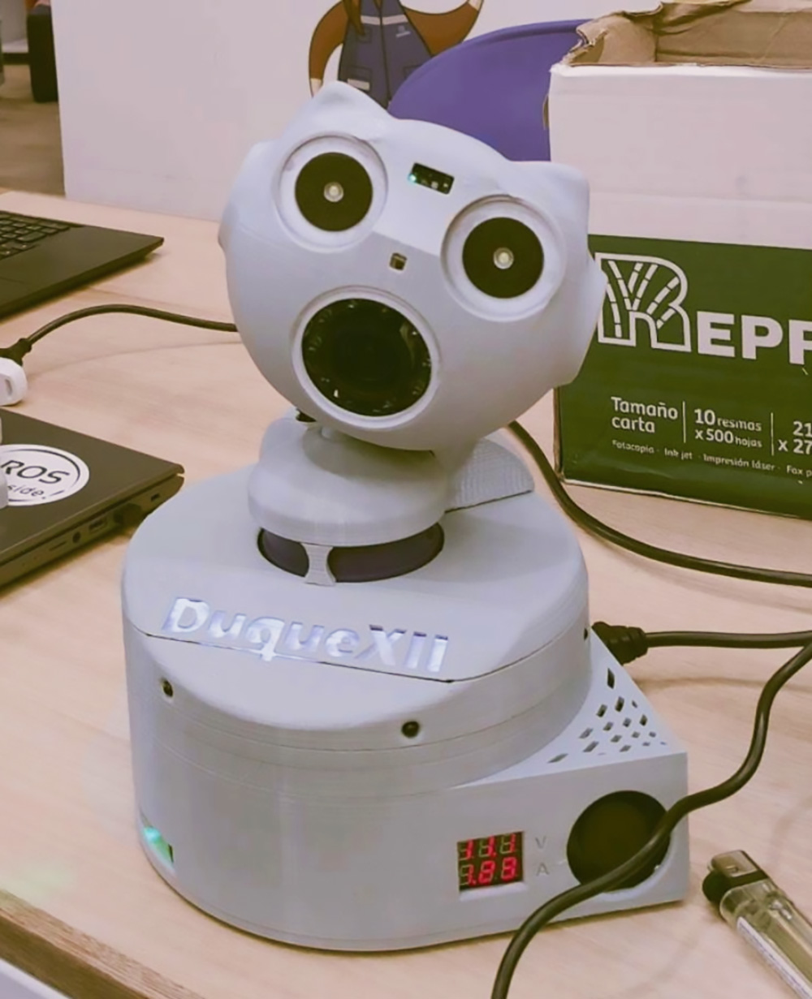

# DuqueXII - Stationary Robot for Domestic Child-Safety Monitoring

<p align="center">
  
</p>

<p align="center">
  
  
  
  
  
  <a href="https://doi.org/10.5281/zenodo.20881362"></a>
  
</p>

---

## Table of Contents

1. [Introduction](#introduction)
2. [Video](#video)
3. [Robot Overview](#robot-overview)
4. [Repository Structure](#repository-structure)
5. [Printed Circuit Boards](#printed-circuit-boards)
6. [System Integration](#system-integration)
7. [Setup](#setup)
8. [Improvements](#improvements)
9. [Future Work](#future-work)
10. [Technologies Used](#technologies-used)
11. [Contact](#contact)
12. [Citation](#citation)
13. [License](#license)

---

## Introduction

DuqueXII is a stationary robotic prototype designed to support the monitoring of domestic risk situations during early childhood. The robot integrates sensing, visual perception, actuation, communication, and a web-based interface to detect and report potentially unsafe conditions in the surrounding environment.

The prototype was developed as a final undergraduate thesis project at Universidad de los Andes by Leffer Trochez, under the supervision of Professors Jorge Alfredo López Jiménez and Nicanor Quijano Silva. DuqueXII uses an Arducam PTZ camera for visual monitoring and camera orientation, together with environmental sensors and embedded processing to coordinate the robot's main functions.

This repository documents the robot prototype, its main hardware and software components, visual materials, reference code, mechanical resources, electronic design files, and demonstration media.

> **Note**  
> The code available in this repository corresponds to a previous development/reference version of DuqueXII. Due to the loss of the original Jetson Nano microSD card containing the final deployment environment, the latest operational code could not be fully recovered. The available code is preserved as a technical reference for understanding the robot architecture, ROS 2 integration, sensor management, perception modules, and web interface. It should not be interpreted as a complete plug-and-play deployment package.

---

## Video

The following video provides a short visual overview of the DuqueXII robot prototype.

https://github.com/user-attachments/assets/b600526c-b047-4748-be59-e298e5338e72

---

## Robot Overview

DuqueXII combines multiple hardware and software modules within a stationary robotic platform. Its main components include:

- **NVIDIA Jetson Nano:** main processing unit for ROS 2 nodes and visual perception.
- **Arduino Nano 33 BLE Sense:** peripheral controller for selected sensors and actuators.
- **Arducam PTZ camera:** visual monitoring with pan, tilt, and zoom capabilities.
- **YOLOv8-based perception:** object detection for selected domestic risk-related classes.
- **Environmental sensing:** monitoring of selected ambient and safety-related variables.
- **Flask web interface:** visual display of robot status, sensor information, and alert messages.
- **ROS 2 communication:** modular organization of software processes and data exchange.

The contribution of DuqueXII as a robot is the integration of these components into a documented child-safety monitoring prototype that connects perception, sensing, actuation, and user interaction within a single robotic system.

---

## Repository Structure

The repository is organized as follows:

```text
.
├── 3D_design/                 # CAD model of the robot
├── Code/                      # Reference code for ROS 2 nodes, Arduino, perception, and web interface
│   └── Web_page_flask/        # Flask-based web interface resources
├── Electronic_schematics/     # Main electronic schematics and connection diagrams
├── Images/                    # Robot images, visual assets, icons, interface screenshots, and media
├── Mechanical_drawings/       # Mechanical drawings of 3D-printed parts
├── Neural_network_training/   # YOLOv8 training resources and related materials
├── Support_videos/            # Videos of selected robot functions
├── LICENSE                    # MIT license
└── README.md                  # Main project documentation
```

Brief description of the main repository contents:

- `3D_design/` contains the CAD model of the robot.
- `Code/` contains reference software components for the robot, including ROS 2 scripts, Arduino code, perception-related files, and the Flask web interface.
- `Electronic_schematics/` contains electronic diagrams, connections, and power-related information.
- `Images/` contains robot photographs, interface screenshots, icons, diagrams, and media used in the README.
- `Mechanical_drawings/` contains drawings and dimensions of mechanical parts.
- `Neural_network_training/` contains object-detection training resources for selected classes such as child, knife, scissors, coin, outlet, medication, adult, and other related categories.
- `Support_videos/` contains short videos of selected robot functions.

---

## Printed Circuit Boards

The PCB resources for DuqueXII are available at the following external link:

[DuqueXII PCBs](https://mega.nz/folder/jAYnmKTD#5Ih3JERNvTSeVLhx3qoRsw)

These files include PCB-related design resources for the circuits used in the robot. The boards were manufactured at the Printed Circuit Laboratory of Universidad de los Andes. Due to file-size limitations, these PCB resources are not stored directly in this GitHub repository.

---

## System Integration

DuqueXII is organized around a modular hardware/software structure. The NVIDIA Jetson Nano acts as the main processing platform for ROS 2 execution and real-time perception, while the Arduino Nano 33 BLE Sense manages selected peripheral sensing and actuation tasks through serial communication.

The robot integrates camera control, object detection, environmental sensing, actuator commands, and web-based visualization. This organization allows each subsystem to remain relatively independent while contributing to the overall behavior of the robotic prototype.

---

## Setup

### Requirements

The original development environment used the following main tools and platforms:

- ROS 2 Foxy
- Ubuntu 20.04
- NVIDIA Jetson Nano with JetPack 4.6
- Arduino IDE 2.3.4
- Python 3.8
- Flask
- OpenCV
- YOLOv8

> **Important**  
> The current repository should be treated as a technical reference. Since the final Jetson Nano deployment environment was not fully recovered, additional configuration, dependency installation, and code adaptation may be required before running the robot.

---

## Improvements

DuqueXII is a first functional prototype, and several aspects can be improved in future versions. Mechanically, the structure could become more modular to simplify assembly, maintenance, and component replacement. Electronically, the wiring and module connections could be optimized for robustness and easier troubleshooting. The perception module could also benefit from a larger and more realistic dataset to improve behavior under diverse domestic conditions.

---

## Future Work

Future versions of DuqueXII could transition from a stationary platform to a mobile robot. A mobile base would allow the robot to follow the child more actively and reduce limitations caused by camera field of view or sensor range. Additional work could also improve robustness, autonomy, perception reliability, power management, and long-term operation in domestic environments.

---

## Technologies Used

<p align="center">
  
  
  
  
  
  
  
  
  
  
  
</p>

---

## Contact

Leffer Trochez <br>
Electronic Engineer and M.Sc. in Electronic and Computer Engineering  
Universidad de los Andes  
Faculty of Engineering  
Department of Electrical and Electronic Engineering  
GIAP Research Group  
Bogotá D.C., Colombia  

<p>
  <a href="mailto:l.trochez@uniandes.edu.co"></a>
  &nbsp;
  <a href="https://www.linkedin.com/in/leffer-trochez/"></a>
  &nbsp;
  <a href="https://scholar.google.com/citations?user=Ve1E4AEAAAAJ&hl=es&oi=ao"></a>
  &nbsp;
  <a href="https://orcid.org/0009-0002-5321-7652"></a>
</p>

---

## Citation

If you use this repository in academic work, research projects, technical reports, or derivative software developments, please cite the archived Zenodo release associated with this project.

This repository has been archived in Zenodo and assigned a DOI for versioned citation:

[https://doi.org/10.5281/zenodo.20881362](https://doi.org/10.5281/zenodo.20881362)

### How to cite

The repository can be cited as software in the following format:

```bibtex
@software{trochez2026duquexii,
  author       = {Trochez, Leffer and López-Jiménez, Jorge Alfredo and Quijano, Nicanor},
  title        = {DuqueXII: Stationary Robot for Domestic Child-Safety Monitoring},
  year         = {2026},
  version      = {1.0.0},
  doi          = {10.5281/zenodo.20881362},
  url          = {https://doi.org/10.5281/zenodo.20881362}
}
```

---

## License

Copyright (c) 2026 Leffer Trochez.

This project is licensed under the MIT License. See the [LICENSE](LICENSE) file for the full license text.
